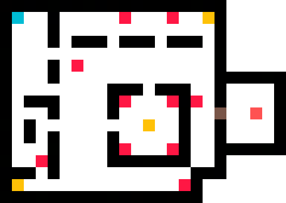
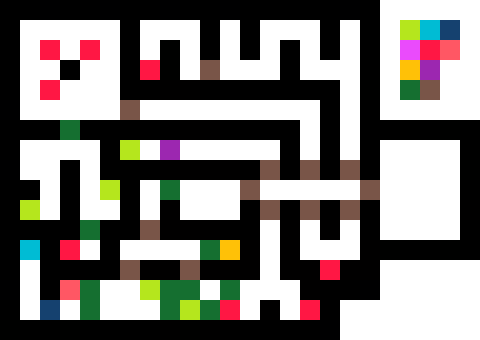

# Your Cave

Karl the architect creates this cave for you when you pay him 15000 gold.
This is only possible after you unlocked the treasure room in the old dwarf mine.
The cave is located to the east of your house at the north end of the garden/field.

The cave has 2 levels. You enter at the top level. There are many holes you
can reach which lead to the lower level. You will need ropes and/or levitation
to proceed. But from every lower room you can access a corridor back
to a ladder which leads to the upper level and eventually back to the cave entrance.

The corridor is accessed by moving a wall by pulling a lever. The room above the
ladder also needs a lever to connect to the cave entrance room. There are also
some fake walls.

At the end you can find a chest. It contains Karl's Ring which grants 25 Swim, 1 Damage,
25 Luck and Magic Defense Level 3. There is a big spider boss.

```
Your Cave - Upper Level
+----------------+
|O   |           |
+--+ | --+----+ ++
|  $ |  O|O      |
| ++-+--++----++ |
| |     $     ++ |
|   | | |! O|    |
|#+-+-+ +---+--+-+
|!|O|O  |O    C|O|
|-+$+---+-++-+-+ |
|         ++ $ # |
|#--+-+-+    |C| |
|  !|O| +-----++#|
+---+ |       |! |
|  L| +-+ +-+ +--+
|!  $ |C   O|   O|
+---+X+-----+----+

O: Hole down
L: Ladder down
!: Lever
$: Moveable wall (removed by lever)
#: Fake wall
C: Chest (1x Rope)
L: Chest (1x Levitation spell, 1 Healing Potion II)
X: Exit

Your Cave - Lower Level
+----------------+
|O               |
| +----+-+-+#+-+ |
| |! B |O$o| |!| |
| $   K+-+     | |
|$+-+ -+ +--+--+ |
|   |    S O|T # |
| +$+------+--+--+
| |O O   O # !| O|
|$+--------+--+#-+
| $              |
|$+---+-+---+ |  |
| $  O|!|   | +- | 
| +-+ | | | +#+  |
| |L| +#+ | | | -+
|   |     |O|!| O|
+---+-----+-+-+--+

O: Hole up
L: Ladder up
!: Lever
$: Moveable wall (removed by lever)
#: Fake wall
S: Spider web (needs torch)
T: Chest (barrel, 3x Torch)
B: Boss room (text event)
o: Ceiling hole is only added by an event
K: Loot with Karl's remains and ring
```

Labdata 2
---------
Walls:
- 1: Plain wall
- 2: Wall with rock 1
- 3: Wall with rock 2
- 4: Wall with rock 3
- 5: Wall with rock 4
- 6: Wall with all 4 rocks
- 7: Fake wall (blocks sight)
- 8: Fake wall (does not block sight)
- 9: Spider web (player can pass)
- 10: Broken spider web (player and monsters can pass)
- 11: Spider web (player can not pass)
- 14: Open door
- Rest not relevant
Objects infos:
- 8: Small stone
- 9: Hanging brown stuff (small)
- 10: Hanging brown stuff (large)
- 11: Barrel
- 12: Stone pile
- 13: Lizard
- 14: Spider (small)
- 18: Ceiling stone
- 22: Ladder down
- 23: Hole down
- 24: Ladder up
- 25: Hole up
- 26: Lever (left)
- 27: Lever (right)
- 29: Pile of trash
- 30: Wooden chest
- 31: Bigger rock
- 32: Medium rock
- 33: Spider (large)
- 34: Spider (ceiling)
- 35: Spider (tiny)
- 36: Earth pillar
- We add 37: Bigger hole down
- And 38: Bigger hole up
Objects:
- 9: Stones
- 10: Hanging brown stuff (small)
- 11: Barrel
- 12: Pile of stones
- 13: Lizard
- 14: Spider (small)
- 19: Bats
- 20: Ladder down
- 21: Ladder up
- 22: Lever (left)
- 23: Lever (right)
- 24: Pile of trash
- 25: Wooden chest
- 26: Spider (large)
- 27: Spider (ceiling)
- 28: Spider (tiny)
- 29: Earth pillar
- We add 30: Hole down
- And 31: Hole up

# Hidden Sea Cave

When you talk to the map maker in Burnville he now will also mention the sea creatures
on the map. When you ask about it, he tells you that he has seen all of them himself
when he was travelling with Torle. You can ask Torle about it as well. The keyword is
given to you by the map maker though.

Torle will give his log book to his rescuers. There are the coordinates of 6 creatures.
- A: Left of the hoimon desert is a giant turtle
- B: Below the forest island is a big whale
- C: North east of hoimon is a giant sea snake
- D: Below the moaning desert is a sword fish
- E: Below the black mountains is a piranha
- X: North west of the forest island is a mermaid

If you visit those places a text event will pop up and you get a little exp.
After visiting A to E, the mermaid at X will calm the ocean and grant you access to
the big vortex. You can then enter it by boat. She will also give you flippers (boots that grant 99 swim).

(TODO: If you can enter the vortex without boat, e.g. by leaving the eagle, there must
be some global var setting nearby in ocean water to avoid entering the vortex without
boat).


```
57x23
MMMMMMMMMMMMMMMMMMMMMMMMMMMMMMMMMMMMMMMMMMMMMMMMMMMMMMMMM
MMM......~~~~~~~~M~~~~~~~MM~~~~~~~~~~~~~~~M~~~..........M
MM......~~~~~~~~~~~~~MM~~M~~~MM~~MMMMMMM~MMM~...........M
M.....~~~~~~~~~~~MM~~~M~~M~~MMMMM~~M~~~~~~MM............M
MM.~~~~~~~~~~~~~~~M~~~~~~MM~~~M~~~MM~MM~M~MMM...........M
MMM~~~~~~~~~~~~~~~MM~MMMMMMMM~~~MMM~~M~~M~~M~~..........M
MMMM~~~~~~~~~~~~~MM~~~~~M~~~M~~MM~~~MM~MMM~MM~~~~.......M
MMMM~~~~~~~~~~~MMMMMMM~~~~M~~~~~MMMMMM~~~MMM~~~~~~~~...MM
MMMMM.~~~~~~~~~~MMMMMMMMMMMMMMMMM~~~~~~~~~~~~~MMMMMM.MMMM
MMMM~~~~~~~~~~~~~~~~~~~~~~~~~~MMMMMMMMMMMMMMMMMM~~~~~~MMM
MMMMMMM~~~~~~~MMMMMMMMMMMMMMM....MMMMMMMMMMMMMMMM~~~~MMMM
MMMMMMMMMMXMMMMMMMMMMMMMMMMMMMMMMMMMMMMMMMMMMMM~~~~~~~MMM
MMMMMMM~~~~~~~~~~~~~~~~~MMMMMMMMMMMMMMMM~~~~~~~~~MMM~MMMM
MMMMM~~~~~~~~~~~~~~~MMMMMMMMMMMMMMMMMMM~~M~~~MM~~MM~~MMMM
M|||||||||...~~~~~~~~~MMMMMMMMMMMMMMMMMM~~~M~~MM~MMMMMMMM
M|.......|....~~~~~~~~~~MMMMM..~~~~~~~~~~MMMM~M.~~~~~MMMM
M|.......|....~~~~~~~~~~~~~~MMMM~MMMMMMMMMMMMMMM~M~M~~~~M
M|.......|.....~~~~~~~~~~~~~~~~MMMMMM~~~~MMM~~MMMM~MMMMMM
M|.......|......~~~~~~~~~~~~~~~~~~~~~~MM~~~~~~~~M~~~~~~MM
M||||OO|||.....~~~~~~~~~~~~~MMMMMMMMMMMMMMMM~~~~~~.MMMMMM
M.............~~~~~~~~~~~~~~~~~~~~~....~~~~~~~MMMMMMMMMMM
MM..........MMMM~~~~~~~MMMMMMMMMM~~~~~~~~MMMMMMMMMMMMMMMM
MMMMMMMMMMMMMMMMMMMMMMMMMMMMMMMMMMMMMMMMMMMMMMMMMMMMMMMMM

Legend:
~ Water
. Beach
M Mountains/Rocks
| Palisades
O Gate
X Rock (can be removed later)
```


In the cave there is a 2D map with beach and water. You have to swim a lot so having
the skill high is good. It is a 2D swim maze. You eventually reach a beach with some
houses in the upper right area. It has some palisades like Spannenberg. You may enter
the village. It is a very small 3D map with mostly closed doors. A ghost town. Ship's End.
Most houses are abandoned (text messages at the door). You can only enter one house.
You will only find a diary which hints that some villagers moved to a castle in the
south west of the cave. You also can find a shovel and a ring of Sobek.

```
Size: 20x12 (with map border)
+-----------+-+--+
|          X|B|  |
| +--+  ----+ +X-+
| |  X           |
| +--+  +---+ +H-+
|       X   X |  |
| +X+   +---+ +--+
| +-+            |
|      +X-+   | B|
+---X--+--+---+--+

H: House which can be entered
B: Barrel with nothing in it (poison ailment)
X: Closed doors or town exit

Labdata 13

Walls:
1: Outer wall
3: Outer door
6: Palisade wall
7: Palisade door
Objects:
12-17: Small plants
Added 23: Barrel
```

At the south of the village you find another passage for swimming. On the way you stumble
onto some undeads, spiders and lizards. You finally reach a castle with some newer houses
around. You can find a raft dealer there. Inside the town there are some buildings:

- Vielauge's Inn (2D)
- Vielauge's Castle (3D)
- Raft dealer (Place)
- Merchant (Place)
- Blacksmith (Place)
- Swim Trainer (Place)

```
Size: 26x18 (with map border)
+----------------------+
|                      |
| +--------+     +-X-+ |
| |        |     |Mer| |
| | Castle +--+  |Bla| |
| |           |  +-X-+ |
| |           X        |
| |           |  +---+ |
| |        +--+  XInn| |
| | +XX+ +-+     +-X-+ |
| +-+  +-+             |
|              +-+ +-+ |
| +-+  +-+ +-+ + + + + |
| +X+  +X+ +X+ +S+ +R+ |
|                      |
+-------------X--------+

Labdata index 31.

Walls:
- 101: Stone wall
- 102: Closed large door
- 104: Closed large door with hammer
- 106: Stone wall with borders
- 108: Stone wall with large window
- 109: Stone wall with small window
- 111: Stone wall with large sign
- 112: Stone wall with small sign
- 115: Palisade wall (added)
- 116: Palisade door (added)

Objects:
- 6: Small bush
- 7: Small bush
- 10: Dark male statue
- 11: Female statue
- 12: Male statue
- 13: Stone pillar
- 14: Yellow pillar
- 15: Metal pillar
- 16: Sand pillar
- 17: Blond guy
- 18: Female elf (black hair)
- 19: Female elf (blond hair)
- 20: Well
- 21: Old wise man
- 22: Knight
```

The raft dealer places a raft at the docks outside the town. He also opens a passage in
a wall so you can directly travel upwards to the cave exit to the world map.

The castle is locked first. In the Inn you can learn that the castle once was occupied
by a cruel monster called Vielauge. Nowadays it is a tourist attraction and a minor part
is the head council's office. But since there were no tourists for a long time, it was
closed and only the office remains open. He also reveals that he himself is the council
and gives you his keys to water the plants for him. He wants to drink beer and stay at the
inn. He is scared of some strange noises in his office.

You can enter the office through a side door. At a specific wall a text popup is shown
that there are strange noises and that the wall looks strange. You can touch it and it
just disappears. You then enter the castle. It has only two levels. The upper level is
crushed and in ruins (it looks like the ancient ruins) so you see the sky. There are
many undeads in the castle. And many walls that can be removed by touching them. You
finally reach the upper level. There awaits a strong undead banshee. It drops a powerful
amulet and again a Ring of Sobek. After the boss fight you will reveal a new level.

Someone in the inn also says that there are many treasures buried in the sands of the cave.
You can use the shovel at several places and access chests. Mostly junk or gold but some
rare items as well.

#### Lower Level


#### Upper Level


### Underground Level


#### Legend:
- Black: Walls
- Red: Monsters
- Brighter red: Boss
- Yellow: Treasure
- Purple: Fake wall
- Pink: Touch disappear wall
- Azure: Ladder
- Brown: Door
- Light green: Lever
- Dark green: Movable wall

New labdata (020):
- For world Lyramion 2Map_data
- Wall height 380
- Floor texture: 3 (dark gray)
- Ceiling texture: 4 (dark gray)
- Walls
 0x65 - Normal wall: 50
 0x66 - Fake wall: 50
 0x67 - Left border: 50, overlay 15 left (0, 0) (32x80)
 0x68 - Right border: 50, overlay 16 right (128-32, 0) (32x80)
 0x69 - Two borders: 50, with both overlay 15 and 16
 0x6A - Large window: 50, with overlay 71 (centered, 64x64)
 0x6B - Single small window: 50, with overlay 72 (centered, 32x58)
 0x6C - Two small windows: 50, with 2x overlay 72 (32x58)
 0x6D - Banner wall: 50, with overlay 70 (48x48)
 0x6E - Sign wall: 50, with overlay 40 (32x19)
 0x6F - Chains: 50, with overlays 33-36 (65,27 16x32, 46,27 16x26, 65,64 16x16, 41,64 16x16)
 0x70 - Door: 46
 0x71 - Darker wall: 146 (needs gfx from 3Walls3D.amb)
 0x72 - Darker wall with light: 147 (place torch on it, needs gfx from 3Walls3D.amb)
- Objects
  - 1: Black male statue
  - 2: Knight statue without weapon
  - 3: Knight statue with weapon
  - 4: Burning torch upper wall
  - 5: Burning torch lower wall
  - 6: Burning torch left wall
  - 7: Burning torch right wall
  - 8: Pile of stones
  - 9: Skeleton
  - 10: Undead monster
  - 11: Crystal orb
  - 12: Small pile of skulls
  - 13: Large pile of skulls
  - 14: Single skull
  - 15: Carpet 2
  - 16: Carpet 4
  - 17: Stone pillar
  - 18: Cage empty
  - 19: Cage with skeleton
  - 20: Ladder down
  - 21: Ladder up
  - 22: Hole down
  - 23: Hole up
  - 24: Flashing lights (manyeyes)
  - 25: Switch left
  - 26: Switch right
  - 27: Burning candles
  - 28: Chandelier
  - 29: Small table with chest on it
  - 30: Iron chest
- Object infos
  - 1: Black male statue
  - 2: Knight statue without weapon
  - 3: Knight statue with weapon
  - 4: Flame
  - 5: Torch
  - 6: Pile of stones
  - 7: Skeleton
  - 8: Undead monster
  - 9: Crystal orb
  - 10: Small pile of skulls
  - 11: Large pile of skulls
  - 12: Single skull
  - 13: Carpet 2
  - 14: Carpet 4
  - 15: Stone pillar
  - 16: Cage empty
  - 17: Cage with skeleton
  - 18: Ladder down
  - 19: Hole down
  - 20: Ladder up
  - 21: Hole up
  - 22: Flashing light
  - 23: Switch left
  - 24: Switch right
  - 25: Burning candle
  - 26: Chandelier (wooden part)
  - 27: Chandelier chain
  - 28: Chandelier candle
  - 29: Small table
  - 30: Iron chest

New labdata (021):
- For world Lyramion 2Map_data
- Wall height 380
- Floor texture: 3 (dark gray)
- Ceiling texture: 0 (sky)
- Walls
 0x65 - Out wall: 153 (needs gfx from 3Walls3D.amb)
 0x66 - Out destroyed wall: 154 (needs gfx from 3Walls3D.amb)
 0x67 - Out door: 46, overlay 92 at 0,0 (16x80) and overlay 93 at 112,0 (16x80)
 - Objects
  - 1: Pile of stones
  - 2: Skeleton
  - 3: Undead monster
  - 4: Small pile of skulls
  - 5: Large pile of skulls
  - 6: Single skull
  - 7: Carpet 2
  - 8: Ladder down
  - 9: Hole down
  - 10: Burning candles
  - 11: Iron chest
- Object infos
  - 1: Pile of stones
  - 2: Skeleton
  - 3: Undead monster
  - 4: Small pile of skulls
  - 5: Large pile of skulls
  - 6: Single skull
  - 7: Carpet 2
  - 8: Ladder down
  - 9: Hole down
  - 10: Burning candle
  - 11: Iron chest


The lever moves the wall away. As mentioned the upper level has a sky and broken walls. The monsters all
are groups of undeads. Some of them are marked as bosses and/or have very high anti-magic so they won't be
affected by holy spells. All doors beside the main entrance and boss door are unlocked so you can just pass them.

The three chests behind the fake walls contain:
- Holy horn
- Much gold
- Horned helmet
- Alcohol
- Healing potions
- Spell potions
- Rations
- Scimitar
- Silver cutlery

The other chest in the lower level contains a cursed dagger and simple clothings.

The chests in the upper level just contain:
- Alcohol
- A little bit gold
- Some healing potions

The chest in the upper level's central room instead contains the key to the boss room.

The first end boss drops the first part of the unique item set for the adventurer. The equipment is not breakable.
- Adventurer's Sword
  Atk: 15, Def: 0, Hands: 1, Spell: Windhowler (**)
  Str +5, Atk +15, Magic Attack Level max
-  Adventurer's Suit
  Atk: 0, Def: 12, Spell: None
  Sta +5, Search +15, Magic Defense Level 3

The second end boss drops the second part of the unique item set.
- Adventurer's Bow
  Atk: 15, Def: 0, Hands: 1, Spell: Magic Projectile (**)
  Str +5, Atk +15, Magic Attack Level max
- Adventurer's Shoes
  Atk: 0, Def: 5, Spell: Haste (25)
  Spd + 5, Swi +99
  
The first boss casts Thunderstorm and Whirlwind and attacks with the adventurer's bow and magic arrows.
He has a huge amount of SP. He also has a Scimitar. He switches to it after he runs out of arrows.
He has 51 of them and he has 3 attacks per round so he can attack 17 rounds at max. Then he switches
to the Scimitar.

He has the following attributes and battle skills:

- STR: 75
- INT: 80
- DEX: 50
- STA: 80
- LUK: 20
- SPD: 95
- A-M: 65
- CHA: 1

- ATK: 95
- PAR: 40
- CRI: 0
- U-M: 95

His base damage is 50 and his variable damage 35.
His magic attack level is max so you can't avoid the damage.

After killing the boss in the upper level, the floor breaks and you fall two stories down.
The floor also breaks in the ground level. A new level is revealed.
You enter a small corridor with 8 doors. 5 only lead to monster fights.
One is a dead end for now and one has a lever behind a fake wall. It opens a wall in one
of the 5 monster rooms (a big room with a pillar in the center). From there you can reach
two new levers. One opens a wall nearby which only holds a monster but also removes a wall
in front of a chest later in the dungeon, the other one opens a wall in the dead end room.
There you will come to a door and a small corridor behind.
There are two more doors. The left one just has a wall directly behind it.
The right one has a lever which removes that wall. There is another lever which removes
the wall between the two rooms and even more walls to reveal the second end boss.
After killing him another wall disappears which reveals a ladder. This leads to the level
above. In this room is again a lever to remove a wall to the entrance hall and also unlocks
the large entrance door of the castle.

### NPCs

- Marel: He is an older man who is the council of Vielauge's Town. He gives you his keys and informs
         you about the castle.
- The rest are only text popup NPCs. Some are inside the inn and some move through the town.
- Town folks:
  - A woman tells you about Ship's end and that she was born there. Sometimes she travels to the ghost
   village with a raft. She informs you about the raft dealer in town.
  - A man tells you that he just recently has landed here. His ship got into a big storm and he was
    the only survivor. Who would have known which world lies here below the vortex.
  - An older man tells you a bit about Vielauge and the castle. He remember the lore about the group
    of heros who killed Vielauge. Then they moved here and left the village of Ship's End.
- Inn folks:
  - A mighty elf woman who stranded a couple of years here. She is an elfish princess who should be
    married to some rich man in Newlake but on their honeymoon the ship crushed on a rock near the
	vortex and she came here. She doesn't know what happened to her husband but she isn't sad about it.
  - An old dwarf is there as well. He is very sad as he should be part of the mission to the green
    jewel but Kire needed some materials and on the way his ship sunk and he landed here. He dreams
	of the jewel every day. He not even can see it from here. :(
  - A woman drinks lot of alcohol and is very drunk. She got depressed down here. No new people for
    a long time. No good men.
  - The innkeeper's small daughter is playing in her room. There are not many kids at her age so it
    is really boring for her. Sometimes at night she plays near the castle and last night she heard
	voices from inside. She ran home scared then. And now she prefers to stay inside.
